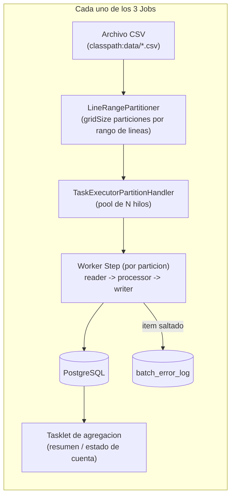
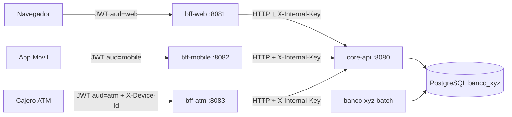

# Banco XYZ - Batch + Backend for Frontend

## Objetivo del proyecto (semanas 1-3)

Reescribir 3 procesos legacy del banco como Jobs de Spring Batch, cumpliendo con:

1. **Configuración de un proyecto Spring Batch** con Jobs y Steps para leer, procesar y escribir CSV.
2. **Procesamiento de datos**: lectura de CSV, transformación/validación con `ItemProcessor`, escritura en PostgreSQL.
3. **Manejo de errores y excepciones**: reglas de consistencia para datos incorrectos/mal clasificados.
4. **Políticas personalizadas de tolerancia a fallos**: `SkipPolicy` custom + retry con backoff.
5. **Escalamiento vía Partitioning**: cada Job particiona su archivo de origen y procesa las particiones en paralelo con un pool de hilos dedicado.

Los 3 Jobs implementados:


| Job                                     | Nombre (Spring Batch)            | Origen                | Descripción                                                                                              |
| --------------------------------------- | -------------------------------- | --------------------- | -------------------------------------------------------------------------------------------------------- |
| Reporte de Transacciones Diarias        | `reporteTransaccionesDiariasJob` | `transacciones.csv`   | Detecta anomalías (montos inválidos, tipos desconocidos, duplicados) y genera un resumen diario.         |
| Cálculo de Intereses Mensuales          | `calculoInteresesMensualesJob`   | `intereses.csv`       | Aplica la tasa de interés según el tipo de cuenta (ahorro/préstamo/hipoteca) y actualiza el saldo final. |
| Generación de Estados de Cuenta Anuales | `estadosCuentaAnualesJob`        | `cuentas_anuales.csv` | Compila los movimientos anuales por cuenta y genera el estado de cuenta para auditoría.                  |


## Arquitectura




Cada Job sigue el mismo patrón:

1. **Step de partición (master)**: un `LineRangePartitioner` divide el archivo CSV en `gridSize` rangos de líneas de tamaño similar.
2. **Worker step (chunk-oriented,** `chunk=5`**)**: cada partición se procesa en paralelo (uno de los `poolSize` hilos del `TaskExecutorPartitionHandler`) con:
  - **Reader**: `FlatFileItemReader` step-scoped, acotado a su rango de líneas vía `setCurrentItemCount`/`setMaxItemCount`.
  - **Processor**: valida, corrige y clasifica cada fila (ver reglas de negocio abajo).
  - **Writer**: `JdbcBatchItemWriter` que inserta en la tabla de negocio correspondiente.
  - **Tolerancia a fallos**: `faultTolerant()` con un `SkipPolicy` custom (`BankSkipPolicy`) y una política de reintento con backoff exponencial para errores transitorios de BD.
3. **Tasklet de agregación** (Jobs de Transacciones y Cuentas Anuales): compila el resumen/estado de cuenta a partir de lo ya persistido.

Los datos originales del CSV **no se descartan silenciosamente**: cada fila termina en la base de datos con un `estado` (`VALIDA`, `VALIDA_CORREGIDA`, `ANOMALIA` o `DUPLICADA`) salvo que le falte un dato estructural imprescindible (ej. el monto), en cuyo caso el `ItemProcessor` lanza una excepción de validación que el `BankSkipPolicy` convierte en un "skip" registrado en `batch_error_log`.

## Estructura del código

Monorepo Maven multi-modulo:

```
banco-xyz-domain          Vocabulario compartido (Canal, EstadoRegistro, TipoCuenta) + db/schema-negocio.sql
banco-xyz-batch           Jobs de las semanas 1-3 (sin cambios de logica)
banco-xyz-core-api        :8080  API de dominio; unico acceso a PostgreSQL
banco-xyz-bff-common      JWT por canal, CoreApiClient y manejo de errores
banco-xyz-bff-web         :8081  respuestas completas y dashboard compuesto
banco-xyz-bff-mobile      :8082  payload minimo, gzip y ETag
banco-xyz-bff-atm         :8083  retiros, sesion corta y auditoria
docs/                     Propuesta tecnica y coleccion HTTP
```

Batch (`banco-xyz-batch/src/main/java/com/bancoxyz/batch/`):

```
BatchApplication.java              Entry point (Spring Boot)
config/                            @ConfigurationProperties (partition, skip, retry, tasas de interes)
common/
├── exception/                     Excepciones de validacion de negocio
├── util/                          Parseo flexible de fechas/numeros
├── partition/                     LineRangePartitioner + factory del PartitionHandler
├── policy/                        BankSkipPolicy (tolerancia a fallos personalizada)
└── listener/                      BankSkipListener (auditoria) y JobSummaryListener (resumen en consola)
transacciones/                     Job 1: reader/processor/writer + Tasklet de resumen diario
intereses/                         Job 2: reader/processor/writer (calculo de interes)
cuentasanuales/                    Job 3: reader/processor/writer + Tasklet de estado de cuenta anual
```

## Reglas de validación y corrección por dataset

### `transacciones.csv` (Job 1)

- Fecha: se prueban los formatos `yyyy-MM-dd`, `dd-MM-yyyy`, `dd/MM/yyyy`, `yyyy/MM/dd` (el legacy mezcla los 4). Si ninguno coincide, la transacción se marca `ANOMALIA`.
- `monto` vacío, no numérico, negativo o cero -> `ANOMALIA`.
- `tipo` fuera de `{debito, credito}` (ej. `invalid`, `desconocido`) -> `ANOMALIA`.
- IDs repetidos dentro de la misma ejecución -> `DUPLICADA` (se conservan para el resumen, no se descartan).
- El Tasklet `ResumenDiarioTasklet` agrega, por fecha: total, válidas, anómalas, duplicadas y montos totales por tipo.

### `intereses.csv` (Job 2)

- `tipo` fuera de `{ahorro, prestamo, hipoteca}` (ej. `-1`) -> **rechazo controlado**: se lanza `InvalidCategoryException`, que el `BankSkipPolicy` transforma en un skip auditado.
- `saldo` vacío/no numérico/negativo -> **rechazo controlado** (`InvalidAmountException`, skip).
- `edad` vacía o fuera de `[18, 90]` (configurable) -> **se corrige** acotando al límite más cercano (o usando la edad mínima si viene vacía) y el registro se marca `VALIDA_CORREGIDA`, documentando la corrección en `observacion`.
- Duplicados exactos (misma cuenta/nombre/saldo/edad/tipo) -> se **filtran** (no se insertan).
- Interés = `saldo_inicial * tasa` (tasa según tipo, configurable en `application.yml`); `saldo_final = saldo_inicial + interes`.

### `cuentas_anuales.csv` (Job 3)

- `monto` vacío/no numérico -> **rechazo controlado** (`InvalidAmountException`, skip): sin monto no se puede registrar el movimiento.
- `descripcion` vacía -> **se corrige** con el valor por defecto `"Sin descripcion"` (no se rechaza el registro).
- Para `retiro`/`compra` el monto se **normaliza** a signo negativo (salida de dinero), documentando la corrección si el signo original era positivo.
- Un `deposito` con monto no positivo, o un `transaccion` fuera de `{deposito, retiro, compra}`, se **conservan** pero se marcan `ANOMALIA` (el objetivo del Job es auditar, no ocultar información).
- El Tasklet `EstadoCuentaTasklet` agrega, por cuenta y año: total depósitos, total salidas, saldo neto anual, cantidad de movimientos y cantidad de anomalías.

## Tolerancia a fallos y escalamiento (Semanas 2 y 3)

- `BankSkipPolicy`: solo permite saltar excepciones de validación de datos conocidas (o errores de parseo de línea); cualquier otra excepción aborta el Job. Límite configurable vía `batch.skip.limit` (default 50 por partición).
- **Retry con backoff exponencial**: errores transitorios de escritura en BD (`TransientDataAccessException`) se reintentan hasta `batch.retry.limit` veces (default 3), con backoff configurable (`batch.retry.initial-interval-ms`, `multiplier`, `max-interval-ms`).
- `BankSkipListener`: registra cada item salteado en `batch_error_log` (job, step, etapa, detalle del item, mensaje de error) para trazabilidad/auditoría.
- **Escalamiento vía Partitioning** (decisión de la Semana 3, en vez de un simple step multi-hilo): `LineRangePartitioner` divide cada CSV en `batch.partition.grid-size` particiones (default **4**) de tamaño similar, que se procesan en paralelo con un `TaskExecutorPartitionHandler` sobre un pool de `batch.partition.pool-size` hilos (default **4**). El tamaño de chunk se mantiene en **5** (heredado de la Semana 2). Estos valores están centralizados en `application.yml` y se pueden ajustar sin tocar código.
- Cada fila persistida guarda en `procesado_por_hilo` el nombre del hilo del pool que la procesó, lo que permite verificar visualmente (con una simple consulta SQL) que el procesamiento efectivamente se paralelizó.

## Requisitos previos

- JDK 21+
- Docker y Docker Compose

## Cómo ejecutar

### 1. Levantar PostgreSQL

```bash
docker compose up -d
```

### 2. Compilar el proyecto

```powershell
.\mvnw.cmd clean package -DskipTests
```

### 3. Ejecutar cada Job de forma independiente

```powershell
# Job 1: Reporte de Transacciones Diarias
.\mvnw.cmd -pl banco-xyz-batch spring-boot:run "-Dspring-boot.run.arguments=--spring.batch.job.name=reporteTransaccionesDiariasJob"

# Job 2: Calculo de Intereses Mensuales
.\mvnw.cmd -pl banco-xyz-batch spring-boot:run "-Dspring-boot.run.arguments=--spring.batch.job.name=calculoInteresesMensualesJob"

# Job 3: Generacion de Estados de Cuenta Anuales
.\mvnw.cmd -pl banco-xyz-batch spring-boot:run "-Dspring-boot.run.arguments=--spring.batch.job.name=estadosCuentaAnualesJob"
```

### 4. Consultar los resultados

```sql
-- Transacciones diarias
SELECT estado, COUNT(*) FROM transacciones GROUP BY estado;
SELECT * FROM resumen_transacciones_diarias ORDER BY fecha;

-- Intereses
SELECT estado, COUNT(*) FROM cuentas_interes GROUP BY estado;
SELECT * FROM cuentas_interes ORDER BY cuenta_id LIMIT 20;

-- Estados de cuenta anuales
SELECT estado, COUNT(*) FROM movimientos_anuales GROUP BY estado;
SELECT * FROM estado_cuenta_anual ORDER BY cuenta_id, anio;

-- Evidencia de paralelismo (Partitioning)
SELECT procesado_por_hilo, COUNT(*) FROM transacciones GROUP BY procesado_por_hilo;

-- Errores / items saltados (tolerancia a fallos)
SELECT * FROM batch_error_log ORDER BY ocurrido_en DESC;
```

## Configuración relevante (`application.yml`)


| Propiedad                                                         | Default            | Descripción                                                    |
| ----------------------------------------------------------------- | ------------------ | -------------------------------------------------------------- |
| `batch.partition.grid-size`                                       | 4                  | Cantidad de particiones por archivo                            |
| `batch.partition.pool-size`                                       | 4                  | Hilos del pool que procesan las particiones en paralelo        |
| `batch.skip.limit`                                                | 50                 | Máximo de items saltados por partición antes de abortar el Job |
| `batch.retry.limit`                                               | 3                  | Reintentos ante errores transitorios de escritura              |
| `batch.intereses.tasa-ahorro` / `tasa-prestamo` / `tasa-hipoteca` | 0.5% / 1.5% / 1.0% | Tasas de interés mensual por tipo de cuenta                    |
| `batch.intereses.edad-minima` / `edad-maxima`                     | 18 / 90            | Rango de edad aceptado (fuera de rango se corrige)             |


## Semanas 4-5: Backend for Frontend

Tres BFF independientes consumen por HTTP el `core-api`. Ningun BFF habla con PostgreSQL: las reglas de integridad (saldo, retiros, idempotencia) viven en un solo lugar.




| Servicio               | Puerto | Contrato         | Autenticacion                              |
| ---------------------- | ------ | ---------------- | ------------------------------------------ |
| `banco-xyz-core-api`   | 8080   | `/internal/**`   | cabecera `X-Internal-Key`                  |
| `banco-xyz-bff-web`    | 8081   | `/api/web/**`    | JWT `aud=web`, 30 min, `ROLE_WEB`          |
| `banco-xyz-bff-mobile` | 8082   | `/api/mobile/**` | JWT `aud=mobile`, 15 min + refresh 30 dias |
| `banco-xyz-bff-atm`    | 8083   | `/api/atm/**`    | tarjeta + PIN + `X-Device-Id`, JWT 3 min   |


Un token de un canal es rechazado por los otros (validacion de audiencia). Swagger UI de cada servicio: `http://localhost:<puerto>/swagger-ui.html`.

### Que expone cada BFF

- **Web**: `POST /api/web/auth/login`, `GET /api/web/dashboard` (perfil + saldo + 20 movimientos + intereses + estado anual en una llamada), `GET /api/web/movimientos` paginado, `GET /api/web/reportes/`*. DTOs con metadatos de auditoria del batch (`estado`, `motivo`, `procesadoPorHilo`).
- **Movil**: `POST /api/mobile/auth/login` y `/auth/refresh`, `GET /api/mobile/inicio`, `/saldo`, `/movimientos`. Payloads planos, montos redondeados, anomalias filtradas, gzip y `ETag` (304 si no cambio el saldo).
- **Cajero**: `POST /api/atm/auth/sesion`, `GET /api/atm/saldo`, `POST /api/atm/retiros` (multiplo de 1000, tope 100000, `Idempotency-Key` obligatoria), `GET /api/atm/movimientos/ultimos`, `POST /api/atm/sesion/cerrar`. Sin datos personales en las respuestas.

### Credenciales de demostracion

Las siembra `SembradorDemo` al arrancar el core-api (password comun `Banco2026*`).


| Usuario         | Cuenta | Canales          | Tarjeta            | PIN    |
| --------------- | ------ | ---------------- | ------------------ | ------ |
| `jane.smith`    | 106    | web, mobile, atm | `4051000000000106` | `1234` |
| `charlie.green` | 109    | web, mobile      | —                  | —      |
| `steve.rogers`  | 117    | web, atm         | `4051000000000117` | `4321` |


Cajeros: `ATM-001` / `llave-atm-001` (Sucursal Centro) y `ATM-002` / `llave-atm-002` (Mall Plaza Norte).

### Orden de arranque

En terminales distintas, despues de `docker compose up -d` y de haber compilado:

```powershell
# 1. Poblar datos (una vez, los tres Jobs)
.\mvnw.cmd -pl banco-xyz-batch spring-boot:run "-Dspring-boot.run.arguments=--spring.batch.job.name=reporteTransaccionesDiariasJob"
.\mvnw.cmd -pl banco-xyz-batch spring-boot:run "-Dspring-boot.run.arguments=--spring.batch.job.name=calculoInteresesMensualesJob"
.\mvnw.cmd -pl banco-xyz-batch spring-boot:run "-Dspring-boot.run.arguments=--spring.batch.job.name=estadosCuentaAnualesJob"

# 2. Nucleo
.\mvnw.cmd -pl banco-xyz-core-api spring-boot:run

# 3. Canales (cada uno en su terminal)
.\mvnw.cmd -pl banco-xyz-bff-web spring-boot:run
.\mvnw.cmd -pl banco-xyz-bff-mobile spring-boot:run
.\mvnw.cmd -pl banco-xyz-bff-atm spring-boot:run
```

Sin los Jobs, el core-api arranca igual y siembra las identidades, pero saldo y movimientos responden 404.