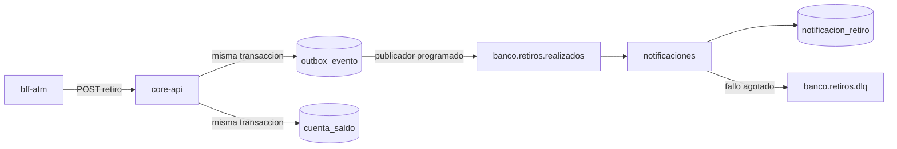

# Arquitectura de eventos de los retiros

El banco usa **notificacion de eventos con outbox transaccional**. No es event sourcing: el saldo sigue viviendo en `cuenta_saldo` y el core-api es la unica fuente de verdad. Kafka solo avisa que un retiro ya quedo confirmado, para que otro servicio lo procese sin acoplar el cajero al comprobante asincrono.

Se eligio Kafka y no JMS porque el despliegue en la nube ya orquesta un broker aparte (`docker-compose.yml`) y el contrato son topicos, no colas de un servidor de aplicaciones.

## Topicos

| Topico | Quien publica | Quien consume | Contenido |
| --- | --- | --- | --- |
| `banco.retiros.realizados` | `banco-xyz-core-api` (publicador del outbox) | `banco-xyz-notificaciones` | Retiro confirmado: `codigoAutorizacion`, `cuentaId`, `monto`, `canal`, `claveIdempotencia`, `saldoResultante`, `referenciaDispositivo` |
| `banco.retiros.dlq` | el consumidor, cuando agota los reintentos | operacion / reproceso manual | El mismo mensaje que no se pudo guardar |

La clave del mensaje es `claveIdempotencia`. El consumidor la usa como clave unica de `notificacion_retiro`, asi un reintento no duplica el comprobante.

## Flujo

1. El cajero pide el retiro al core.
2. En una sola transaccion el core descuenta el saldo, escribe la bitacora y deja una fila en `outbox_evento`.
3. Un publicador lee las filas no publicadas y las manda al topico. Si Kafka no esta, la fila queda pendiente y se reintenta: el cliente no se cobra dos veces.
4. `banco-xyz-notificaciones` persiste el comprobante. Si el mensaje es invalido y los reintentos se agotan, va a `banco.retiros.dlq`.
